###Vers un framework pour la circulation des connaissances
####~ WIP ~
<small>Nicolas Sauret / [@nicolasauret](http://twitter.com/nicolasauret)</small>

Note::Je clos ces journées d'étude en vous présentant un travail en cours, inachevé, davantage porteur de questions que de réponses, et qui permettra de terminer ce colloque sur une note d'interrogation. C'est un travail encore très empirique qui me sert un peu de prétexte pour poser quelques bases de réflexion pour une thèse à venir qui viendra concrétiser 5 années de recherche, de prototypage, de projets à l'Institut de Recherche et d'Innovation.

!!<!-- .element: class="fragment fade-in" -->

##Hypothes.is
[http://hypothes.is](http://hypothes.is)

<blockquote>&ldquo; The web, peer-reviewed &rdquo;</blockquote> <!-- .element: class="fragment fade-in" -->

Note::J'ai ainsi démarré l'analyse d'un service récent Hypothes.is, remarqué par Marc Jahjah lors de sa thèse sur les marginalia, et qui se présente comme un service d'annotation du web.
Il existe désormais plusieurs services soit similaires dans leur fonctionnement, soit analogue dans le résultat, que ce soit les services de d'annotation de document (Crocodoc, Co-ment, E-comma, etc.), de bookmarking ([Delicious](delicious.com), Diigo), ou encore les réseaux sociaux scientifique [Academia, ResearchGate, Myscience Work] qui intègre des fonctionnalités d'annotation.
Hypothes.is a la particularité de prétendre avoir rassemblé ce qui se faisait de mieux du point de vue technique, éthique, juridique, politique, pour proposer rien de moins que *"the web, peer-reviewed"*.
Le web, *revue par les pairs*, laisse entendre un certain positionnement scientifique. Ce n'est qu'un slogan me direz vous, mais il reflète l'intention louable des concepteurs, intention potentiellement peu attractive, d'inciter ses usagers à adopter une démarche scientifique de certification et de légitimation des contenus du web.
Peu attractive, à moins de considérer que les notions même de *pairs*, de *communauté de pairs*, et finalement de *revue par les pairs* se sont démocratisées et ont contaminé des sphères moins savantes de pairs, des bloggers, des amateurs, des communautés de savoir et d'expertise qui se sont mis tous ensemble à écrire, à publier et à se lire mutuellement. Qui se sont tous mis à une certaine forme de rigueur, sous le regard de leurs pairs.

!!

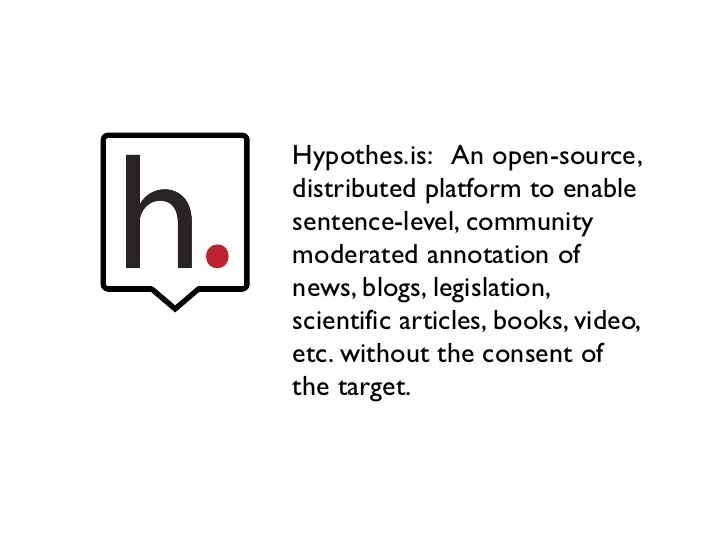
Note::Quoiqu'il en soit, porter une telle promesse de légitimer les contenus du web par une pratique héritée de la Science, légitime par ricochet le service lui-même.
Malgré tout, il convient de creuser et d'aller au-delà du *discours d'accompagnement*, pour reprendre les termes de Marc Jahjah.

!!

##Launch

///

&nbsp;

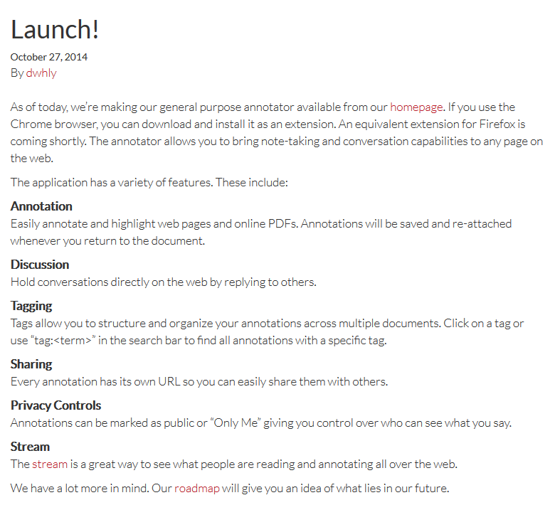

Note::**Le lancement** du service s'est fait en octobre dernier avec un bookmarklet pour Firefox.
Il consiste à intégrer en un clic **des fonctionnalités d'annotation** à n'importe quelle page web.
Depuis, Hypothes.is évolue et s'améliore au fil des semaines. 
**En décembre dernier**, la homepage ressemblait à ça, plus récemment, **la homepage** s'est fait plus didactique, plus attractive, et les fonctionnalités nouvelles ne cessent d'être annoncées.
Comme par exemple **ce service** appelé VIA, qui simplifie la procédure d'annotation sur une URL et qui permet d'ajouter par défaut le service d'annotation sur ses propres pages.
Le site met en avant une page de **Principes**, 12 engagements constitutifs de l'organisation. 
Ainsi qu'une page **Roadmap** qui liste les fonctionnalités à venir. La lecture de ces deux pages suggèrent que ses concepteurs ont une certaine longueur d'avance sur des services similaires.

///

Annotations

&nbsp;

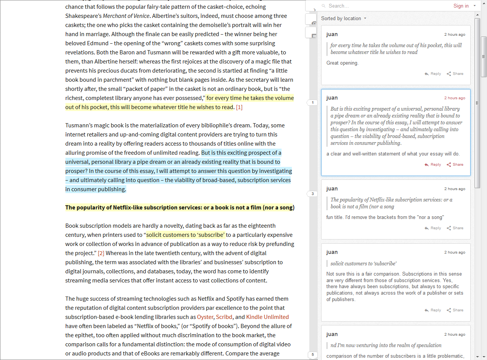

Note::**Le lancement** du service s'est fait en octobre dernier avec un bookmarklet pour Firefox.
Il consiste à intégrer en un clic **des fonctionnalités d'annotation** à n'importe quelle page web.
Depuis, Hypothes.is évolue et s'améliore au fil des semaines. 
**En décembre dernier**, la homepage ressemblait à ça, plus récemment, **la homepage** s'est fait plus didactique, plus attractive, et les fonctionnalités nouvelles ne cessent d'être annoncées.
Comme par exemple **ce service** appelé VIA, qui simplifie la procédure d'annotation sur une URL et qui permet d'ajouter par défaut le service d'annotation sur ses propres pages.
Le site met en avant une page de **Principes**, 12 engagements constitutifs de l'organisation. 
Ainsi qu'une page **Roadmap** qui liste les fonctionnalités à venir. La lecture de ces deux pages suggèrent que ses concepteurs ont une certaine longueur d'avance sur des services similaires.

///

Homepage décembre 2014

&nbsp;

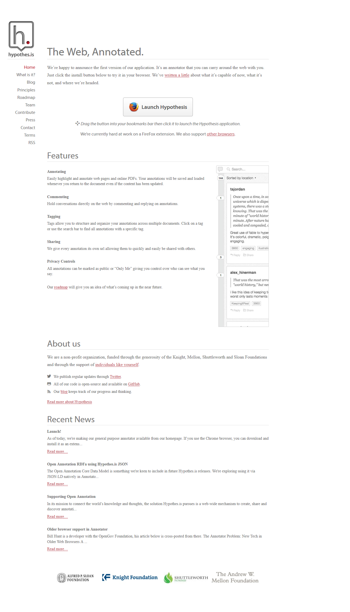

Note::**Le lancement** du service s'est fait en octobre dernier avec un bookmarklet pour Firefox.
Il consiste à intégrer en un clic **des fonctionnalités d'annotation** à n'importe quelle page web.
Depuis, Hypothes.is évolue et s'améliore au fil des semaines. 
**En décembre dernier**, la homepage ressemblait à ça, plus récemment, **la homepage** s'est fait plus didactique, plus attractive, et les fonctionnalités nouvelles ne cessent d'être annoncées.
Comme par exemple **ce service** appelé VIA, qui simplifie la procédure d'annotation sur une URL et qui permet d'ajouter par défaut le service d'annotation sur ses propres pages.
Le site met en avant une page de **Principes**, 12 engagements constitutifs de l'organisation. 
Ainsi qu'une page **Roadmap** qui liste les fonctionnalités à venir. La lecture de ces deux pages suggèrent que ses concepteurs ont une certaine longueur d'avance sur des services similaires.
///

Homepage actuelle

&nbsp;

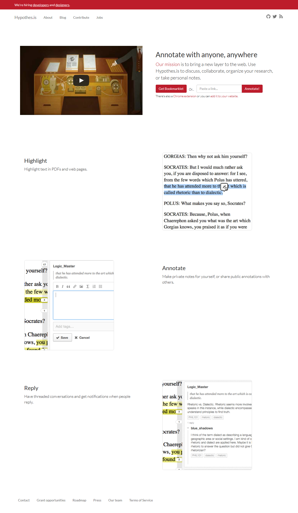

Note::**Le lancement** du service s'est fait en octobre dernier avec un bookmarklet pour Firefox.
Il consiste à intégrer en un clic **des fonctionnalités d'annotation** à n'importe quelle page web.
Depuis, Hypothes.is évolue et s'améliore au fil des semaines. 
**En décembre dernier**, la homepage ressemblait à ça, plus récemment, **la homepage** s'est fait plus didactique, plus attractive, et les fonctionnalités nouvelles ne cessent d'être annoncées.
Comme par exemple **ce service** appelé VIA, qui simplifie la procédure d'annotation sur une URL et qui permet d'ajouter par défaut le service d'annotation sur ses propres pages.
Le site met en avant une page de **Principes**, 12 engagements constitutifs de l'organisation. 
Ainsi qu'une page **Roadmap** qui liste les fonctionnalités à venir. La lecture de ces deux pages suggèrent que ses concepteurs ont une certaine longueur d'avance sur des services similaires.
///

VIA

&nbsp;

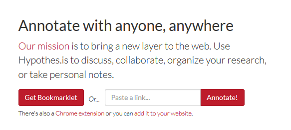

Note::**Le lancement** du service s'est fait en octobre dernier avec un bookmarklet pour Firefox.
Il consiste à intégrer en un clic **des fonctionnalités d'annotation** à n'importe quelle page web.
Depuis, Hypothes.is évolue et s'améliore au fil des semaines. 
**En décembre dernier**, la homepage ressemblait à ça, plus récemment, **la homepage** s'est fait plus didactique, plus attractive, et les fonctionnalités nouvelles ne cessent d'être annoncées.
Comme par exemple **ce service** appelé VIA, qui simplifie la procédure d'annotation sur une URL et qui permet d'ajouter par défaut le service d'annotation sur ses propres pages.
Le site met en avant une page de **Principes**, 12 engagements constitutifs de l'organisation. 
Ainsi qu'une page **Roadmap** qui liste les fonctionnalités à venir. La lecture de ces deux pages suggèrent que ses concepteurs ont une certaine longueur d'avance sur des services similaires.
///

Principes

&nbsp;

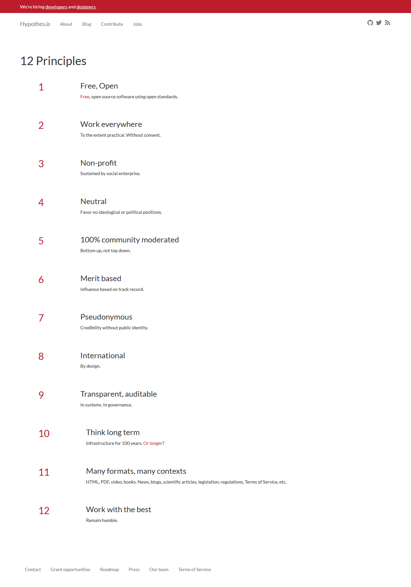

Note::**Le lancement** du service s'est fait en octobre dernier avec un bookmarklet pour Firefox.
Il consiste à intégrer en un clic **des fonctionnalités d'annotation** à n'importe quelle page web.
Depuis, Hypothes.is évolue et s'améliore au fil des semaines. 
**En décembre dernier**, la homepage ressemblait à ça, plus récemment, **la homepage** s'est fait plus didactique, plus attractive, et les fonctionnalités nouvelles ne cessent d'être annoncées.
Comme par exemple **ce service** appelé VIA, qui simplifie la procédure d'annotation sur une URL et qui permet d'ajouter par défaut le service d'annotation sur ses propres pages.
Le site met en avant une page de **Principes**, 12 engagements constitutifs de l'organisation. 
Ainsi qu'une page **Roadmap** qui liste les fonctionnalités à venir. La lecture de ces deux pages suggèrent que ses concepteurs ont une certaine longueur d'avance sur des services similaires.
///

Roadmap

&nbsp;

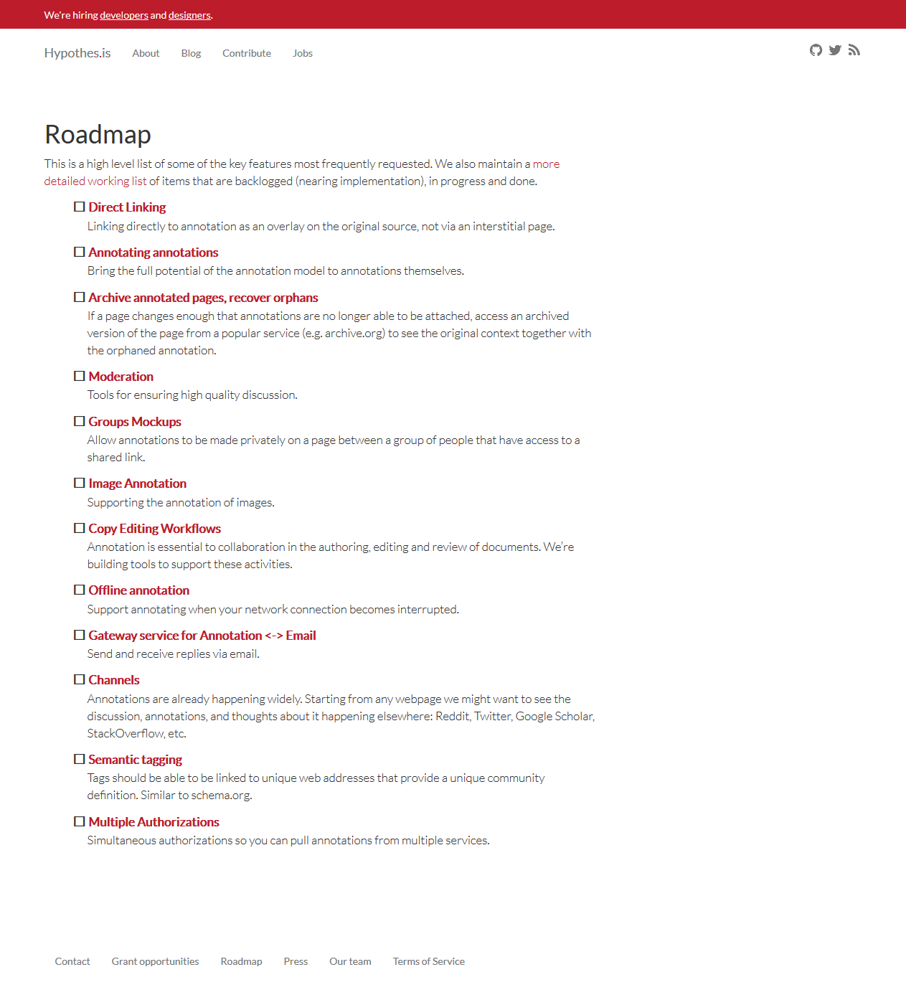 

Note::**Le lancement** du service s'est fait en octobre dernier avec un bookmarklet pour Firefox.
Il consiste à intégrer en un clic **des fonctionnalités d'annotation** à n'importe quelle page web.
Depuis, Hypothes.is évolue et s'améliore au fil des semaines. 
**En décembre dernier**, la homepage ressemblait à ça, plus récemment, **la homepage** s'est fait plus didactique, plus attractive, et les fonctionnalités nouvelles ne cessent d'être annoncées.
Comme par exemple **ce service** appelé VIA, qui simplifie la procédure d'annotation sur une URL et qui permet d'ajouter par défaut le service d'annotation sur ses propres pages.
Le site met en avant une page de **Principes**, 12 engagements constitutifs de l'organisation. 
Ainsi qu'une page **Roadmap** qui liste les fonctionnalités à venir. La lecture de ces deux pages suggèrent que ses concepteurs ont une certaine longueur d'avance sur des services similaires.

!!

##ADN
Statut - Code - licence - Terms of service

Note::Regardons d'un peu plus près l'ADN d'hypothes.is, à travers ses statuts, son code, la licence sur les contributions, et ses termes of service.

///

###Statuts

- **organisation à but non-lucratif**
- crowdfunding : **230K USD**
- fondations :  **Knight, Mellon, Shuttleworth, Sloan** et **Helmsley Foundations**

Note:: Hypothes.is est une organisation à but non-lucratif, financée sur une opération de crowdfunding en 2011 à hauteur de 230 mille dollars américain, et est soutenue aujourd'hui par 5 fondations.

///

###Code
- **Open source**, FreeBSD licence
- compatible avec **les standards W3C** 
- membre actif du **groupe W3C Web annotation**, 
- basé sur une librairie **annotator.js**

Note::Le code d'Hypothesis est Open Source, sous licence FreeBSD. Le service est non-seulement comptatible avec les standards W3C, mais l'équipe est surtout activement mobilisée dans le groupe de travail Web Annotation du W3C dont le travail de définition est encore en cours.
Hypothesis a notamment organisé et hébergé la derière conférence Annotate 2014.
Le code lui-même est basé sur la librairie Annotator.js, qui bénéficie d'une communauté très active avec le développement d'une vingtaine de [plugins](http://annotatorjs.org/plugins/index.html), et l'intégration dans [plusieurs projets d'envergure](http://annotatorjs.org/showcase.html) comme Hypothes.is, the [Open Video Annotation Project](http://openvideoannotation.org/) de Harvard, la plateforme de MOOC [EdX](http://www.edx.org/) (MIT, Harvard et Berkley), ou encore the [Annotation Studio](http://www.annotationstudio.org/) de l'Hyperstudio au MIT, etc.
Cela implique que Hypothesis ne repose pas uniquement sur sa propre technologie mais bénéficie indirectement d'une communauté active d'acteurs et de développeurs, essentiels à la pérennité de tout service.

///

###licence 
**CC0 Public Domain**

<!-- .element: class="fragment fade-in" -->
<!-- .element: class="fragment fade-in" -->

Note::Toutes les annotations posées par les contributeurs sont sous licence CC0 Public Domain.
Le choix de cette licence créée par les Creative Commons est intéressante mais potentiellement problématique.

Intéressante parce qu'en versant les contributions d'emblée dans **le domaine public**, les fondateurs d'Hypothe.is non seulement se défont de toute problématique de propriété et de droits sur les données, mais surtout coupe l'herbe sous le pied de toute volonté de récupération mercantile de ces données. La communauté utilisant Hypothes.is ne pourra pas subir le même sort que celle de Goodreads, racheté par Amazon en mars 2013 et qui a créé un grand désarroi dans cette communauté d'amateur.
Problématique malgré tout, car en s'élevant (pourquoi dire "tomber") dans le domaine public, les contributeurs sont eux-aussi dépossédés non pas de leurs données, mais de leurs droits sur ces données, droits qui demeurent une **pierre essentielle à la construction d'un commun**.
Ainsi, la CC0 protège certes les ressources d'une enclosure, mais anihile la possibilité de construction d'un commun.

///

###ToS
*Nym policy* : **pseudonymat**

&nbsp;

<!-- .element: class="fragment fade-in" -->

Note::Des Terms of services, on retiendra surtout le choix d'une politique de l'anonymat. 
Dans *Design de la visibilité*, Dominique Cardon définit une typologie des réseaux sociaux, en plaçant les différentes plateformes sur deux axes : un axe Être-Faire et un axe Réel-Projeté. En permettant l'anonymat, l'identité sur Hypothesis relève davantage d'une *dynamique expressiviste*, le "Faire" : l'identité et la reconnaissance sont essentiellement couplés à l'expression elle-même, non pas l'expression de soi, mais l'expression d'idée.
Au contraire des plateformes comme ResearchGate ou Academia, où l'identité et la légitimité se construisent davantage sur le profil, constitué pour une grande part par le statut de l'individu, et pour une autre, par les métriques associées à ses publications. On est du côté du "Être".

!!

##Fonctionnalités

- Annotation
- Discussion
- Tagging
- Partage
- Privacy
- Stream
- Open standards
- Service VIA

Note::Très rapidement les fonctionnalités actuelles :

- **Annotation**
- **Discussion** : possibilité de répondre aux annotations
- **Tagging** : structure et organise les annotations transversalement d'un document à un autre. Une requête sur un tag permet de retrouver tous les documents associés.
- **Partage** : chaque annotation possède sa propre URL et est donc facilement partageable.
- **Privacy** : les annotations peuvent être publiées et visibles par tous, ou seulement par l'annotateur.
- **Stream** : une fonction de flux permet de voir ce qui est lu et annoté à travers le web.
- **Open standards** : actif dans le  Web annotation working group du W3C
- **Service VIA** : porte d'entrée simplifiée du service (champs URL > ouvre la page en mode annotation)

!!

##11. Roadmap

<table><tbody><tr>
<td>
  	<ul>
  		<li>Liens directs</li>
    	<li>Annoter les annotations</li>
    	<li>Archive des pages</li>
    	<li>Moderation</li>
    	<li>Groupes de travail</li>
    	<li>Annotation d'image</li>
	</ul>
</td>
<td>
	<ul>
		<li>Gestion d'édition</li>
		<li>Mode déconnecté</li>
		<li>Channels</li>
		<li>Tagging sémantique</li>
		<li>Autorisation multiple</li>
	</ul>
</td></tr></tbody></table>

Note::La roadmap, je vois le temps qui passe, donc je fais de même.

* **Liens directs** : que chaque annotation possède une URL ouvrant l'annotation sur la page source, plutôt que sur une page intermédiaire.
* **Annoter les annotations** : Rendre le modèle d'annotation récursif, permettant d'annoter les annotations.
* **Archive des pages** : archiver les pages annotées et conserver les annotations orphelines (c'est ce que Zotero sait bien faire. Par défaut, Zotero fait un snapshot des pages référencées)
* **Moderation** : un outil pour assurer "une discussion de haute qualité"
* **Groupes de travail** : possibilité pour un groupe d'utilisateur de privatiser un espace d'annotation.
* **Annotation d'image**
* **Gestion d'édition** : édition et révision de documents (ce que co-ment propose déjà)
* **Mode déconnecté**
* **Channels** : distribution des annotations vers d'autres plateformes > Reddit, twitter, Google scholar, stackoverflow, etc.
* **Tagging sémantique** : les tags devraient pouvoir être référencés par une adresse unique correspondant à la définition d'une communauté particulière (comme schema.org)
* **Autorisation multiple** : autorisations simultanées pour requêter des annotations de différents services

!!

Technologies intellectuelles 
<i class="fa fa-arrow-up"></i>
<!-- .element: class="fragment fade-in" -->
###Dispositifs d'éditorialisation

<i class="fa fa-arrow-down"></i> 
Lieux de savoirs
<!-- .element: class="fragment fade-in" -->

<i class="fa fa-arrow-down"></i> 
Communautés scientifiques
<!-- .element: class="fragment fade-in" -->

Note::- Mettons temporairement Hypothes.is de côté pour élargir un peu le champs avant de le re-serrer. Je m'intéresse aux **dispositifs d'éditorialisation** en tant que **technologies intellectuelles**.
- Plusieurs travaux essentiels ont défini les technologies intellectuelles (Jacques Goody, Pierre Levy, Bourdieu), d'autres ont exploré les technologies numériques, ont cherché à identifier leurs primitives (Bruno Bachimont, Christian Jacob, Milad Douhei). Nous travaillons nous-même à l'IRI sur de telles technologies, tant sur le plan pratique que théorique.
- Ici, je réfléchis à des dispositifs susceptibles d'équiper les plateformes et les **lieux de savoir**, qu'ils soient éditeur, bibliothèque, portail d'archive ou de ressource, réseau social de communauté scientifique, etc.
- Des dispositifs outillant directement la **communauté scientifique** dans l'élaboration et la circulation des connaissances.

///

###*dispositif*
> **Pour une définition de la notion de dispositif**

<small>Rémy Besson, 2012 http://culturevisuelle.org/cinemadoc/2012/09/26/dispositif/</small>

Note::- Il faudrait bien sûr définir la notion de dispositif. Mais ne faisant que passer 20 minutes, je vous renvoie à Rémy Besson, qui nous rappelle qu'un dispositif est toujours un agencement, un système de relations entre différentes choses.
- Un dispositif articule des ressources, il adresse des acteurs agissant, il s'inscrit dans un environnement, un évenement, un lieu. Dans notre cas, considérons que les acteurs sont les chercheurs et les ressources sont les connaissances produites et accessible dans ces lieux de savoir.

///

###*Éditorialisation*
> <small>L’éditorialisation est un processus complexe résultant des interactions entre des contenus (ou des ressources), un environnement technique (le réseau, les serveurs, les plateformes, les CMS, les algorithmes des moteurs de recherche), des structures et formats (l’hypertexte, le multimédia, les métadonnées), et des pratiques (l’annotation, les commentaires, les recommandations via réseaux sociaux).

>Ce processus d’organisation et d’agencement des contenus numériques est par essence ouvert et dynamique.</small>

<small>Marcello Vitali Rosati et Nicolas Sauret [Séminaire *Écritures numériques et éditorialisation*](http://www.iri.centrepompidou.fr/evenement/nouvelles-formes-editorialisation/#tabsSeminaire-5)</small>

Note::Il faudrait également définir l'éditorialisation. Pour cela, je vous renvoie à l'argumentaire du séminaire écritures numériques et éditorialisation que nous organisons avec Marcello, pour lequel nous avons écrit que : ...

je vous propose une sélection de 4 dispositifs génériques, 4 organes de l'organologie scientifique avec chacun leur finalité dans le cycle de la recherche.

!!

##Cycle de la recherche

&nbsp;

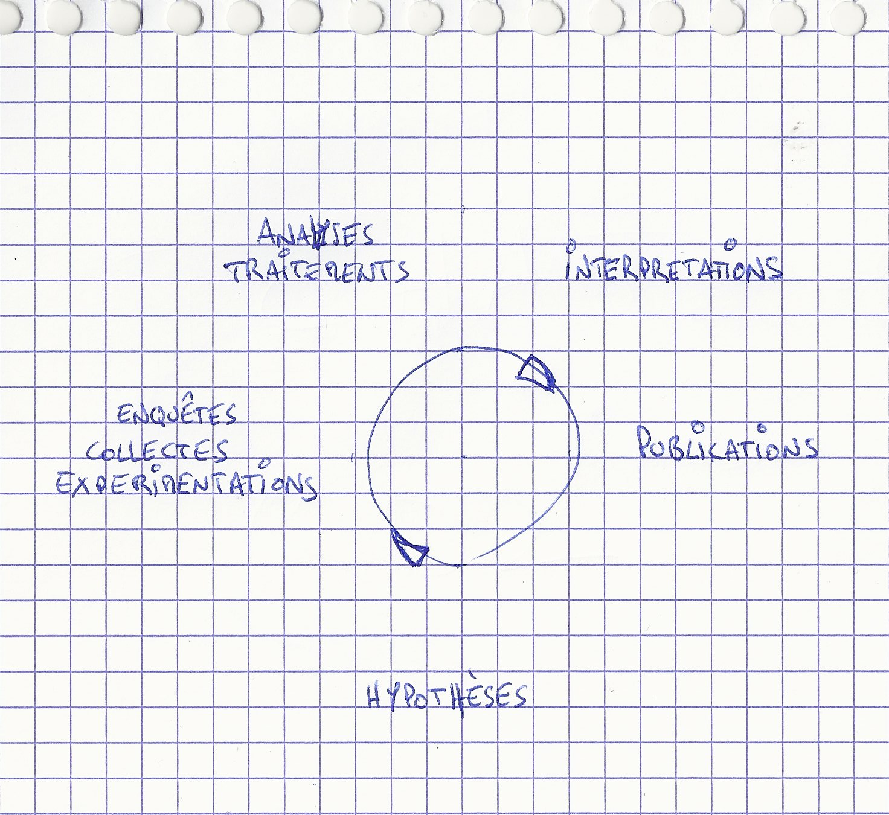

Note::Parenthèse sur ce cycle. Dans ce schéma très caricatural, je m'intéresse à ce qui se passe plus spécifiquement autour de cette étape de publication. 
On sait bien aujourd'hui que ce cycle est en pratique profondément bouleversé, alors même que l'économie de la recherche en général, et de l'édition scientifique particulièrement, continuent de maintenir un cycle qu'il conviendrait pourtant de réinventer.
Pour s'en rendre compte, il suffit de voir à quel point toutes les étapes du cycle intègrent aujourd'hui des micro-cycles très rapides de publication. Chaque étape a développé une certaine porosité à la communication et de manière plus intéressante une ouverture à la contribution par les communautés de pairs ou par des communautés plus larges.

!!

###Dispositifs génériques

&nbsp;
<!-- Enquêtes <i class="fa fa-arrow-right fa-2x"></i> Analyses <i class="fa fa-arrow-right fa-2x"></i> Publication <i class="fa fa-arrow-right fa-2x"></i> Hypothèses <i class="fa fa-arrow-right fa-2x"></i>Médiation<i class="fa fa-arrow-right fa-2x"></i> -->

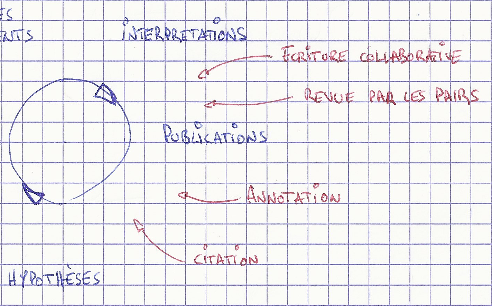 <!-- .element: class="fragment fade-in" data-fragment-index="5" -->

* Écriture collaborative <!-- .element: class="fragment fade-in" data-fragment-index="1" -->
* Revue par les pairs <!-- .element: class="fragment fade-in" data-fragment-index="2" -->
* Annotation <!-- .element: class="fragment fade-in" data-fragment-index="3" -->
* Citation <!-- .element: class="fragment fade-in" data-fragment-index="4" -->

Note::

1. **Écriture collaborative** : ce sont les éditeurs de texte, j'y inclus à la fois les éditeurs avec suivi de modification, les outils de révisions de documents, les éditeurs temps-réel comme etherpad, etc.
Ces dispositifs sont à visée rédactionnelle : écrire ensemble.
2. **Revue par les pairs + discussion ** : ce sont des outils propre à la certification en vue d'une publication. Je les distingue des dispositifs d'annotation ...
3. **Annotation** : ... dont la visée est davantage la circulation du savoir.
4. **Citation** : qui permettent une traçabilité des sources. 

---

- La revue par les pairs a une valeur de **légitimation qualitative**, tandis que la citation a une valeur de **légitimation quantitative** fonctionnant sur une logique d'accumulation. Dominique Cardon parle d'une *"métrique de valorisation de l'identité"*.
- l'annotation, elle s'inscrit dans une autre temporalité, plus longue et plus pérenne, tant pour l'annotateur lui-même que pour ses pairs. Elle permet d'indexer, de fragmenter, de sélectionner, elle ouvre la voie à de nouvelles représentations, de nouvelles éditorialisation. Elle est le support de la controverse et, de par le réagencement des fragments, le support de l'interprétation.

!!

###Enjeux
&nbsp;			|&nbsp;
--: 			| :-- 
**Circulation** 	| transmission dans le temps & communication dans l'espace
**Appropriation** 	| manipulation & interprétation

<i class="fa fa-arrow-up"></i> Dispositifs d'éditorialisation
 <!-- .element: class="fragment fade-in" -->

Note::Au-delà de leurs fonctions dans le cycle de la connaissance scientifique, ces dispositifs sont de nouveaux vecteurs de circulation et d'appropriation des connaissances.

La circulation est bien évidemment une condition de l'appropriation et les deux vont de paires
Or les dispositifs d'éditorialisation les conditionnent fortement tous les deux, et le milieu technique numérique des dispositifs, cad aussi leur support ou plutôt leur environnment, leur confère de nouveaux super-pouvoirs.
les outils et services qui les mettent en oeuvre et qui émergent aujourd'hui, comme par exemple hypothes.is, permettent à certains d'anticiper non pas simplement **une rupture épistémologique** propre à telle ou telle discipline, mais une nouvelle *epistémé*, c'est-à-dire une transformation profonde des modalités d'échanges et de relations entre discipline, ou plutôt entre communautés scientifiques.
<!-- Ref : vecteur > cf graphe et schéma de réseau -->

!!
<!-- .slide: data-transition="fade" -->

##Communautés de savoirs

&nbsp;

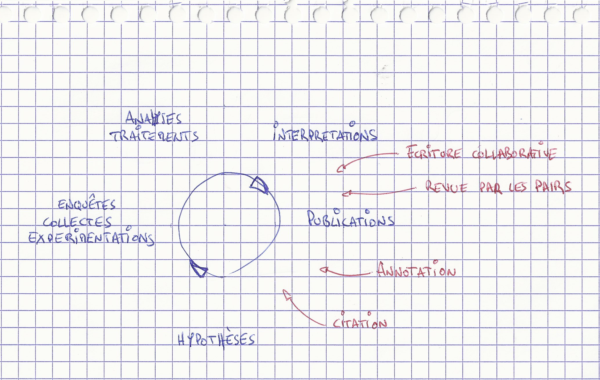
 

Note::Finalement, les notions de circulation et d'appropriation suppose l'enjeu social d'un élargissement de la communauté scientifique à des communautés moins savantes. 
Dans ce modèle très simplifié, il faudrait en fait ajouter la médiation qui m'intéresse plus particulièrement, puisqu'elle s'articule directement avec les dispositifs d'éditorialisation, notamment les dispositifs d'annotation, et qu'elle est au coeur des processus de circulation et d'appropriation vers des communautés de savoirs élargies.

///
<!-- .slide: data-transition="fade" -->

##Communautés de savoirs

&nbsp;

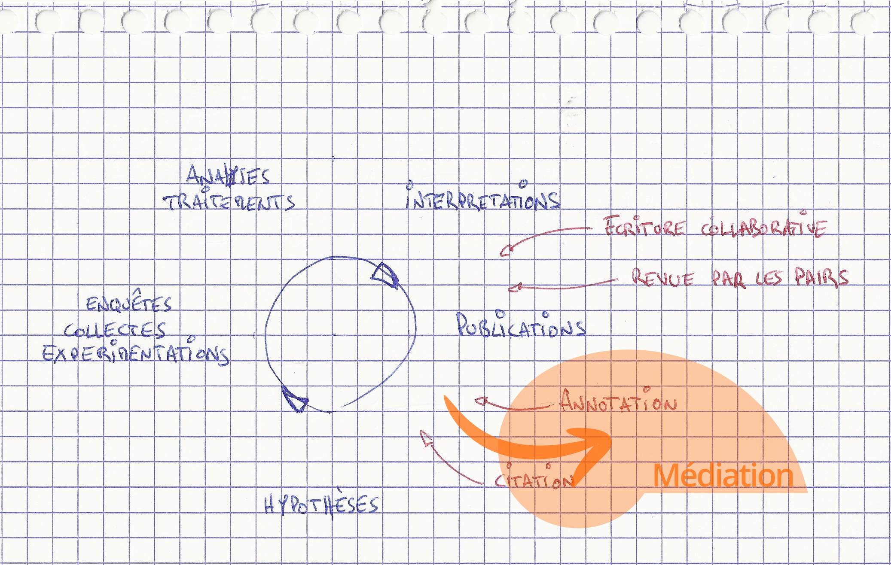
 

Note::Finalement, les notions de circulation et d'appropriation suppose l'enjeu social d'un élargissement de la communauté scientifique à des communautés moins savantes. 
Dans ce modèle très simplifié, il faudrait en fait ajouter la médiation qui m'intéresse plus particulièrement, puisqu'elle s'articule directement avec les dispositifs d'éditorialisation, notamment les dispositifs d'annotation, et qu'elle est au coeur des processus de circulation et d'appropriation vers des communautés de savoirs élargies.

!!

###Mediation
Ressources <!-- .element: class="fragment fade-in" -->
 <i class="fa fa-arrow-right"></i> accès <!-- .element: class="fragment fade-in" -->
 + réappropriation  <!-- .element: class="fragment fade-in" --> <i class="fa fa-arrow-right"></i>  Communautés<!-- .element: class="fragment fade-in" -->

Note::Finalement, pour les lieux et les institutions de savoir, organiser la circulation de ses **ressources** ne consiste plus seulement à y donner **accès**, il s'agit désormais d'en organiser la **réappropriation**.
Cela nécessite de repenser la médiation des ressources dans le sens d'un élargissement de la communauté scientifique à **d'autres communautés de savoir**, ou autrement dit à organiser la porosité entre réseaux de pairs.
C'est certes une question de Knowledge Design, mais aussi une question de Design de communauté, ou encore de la visibilité des pairs, qui est un des aspects parmi d'autres.

La question qui se pose alors : comment les dispositifs d'éditorialisation organisent ces réseaux, comment modélisent-ils et structurent-ils les interrelations entre ses acteurs ?

!!

##Hypothes.is modélisé
Objets {Ressource, Annotation, Tag, Contributeur}

Note::En m'inspirant des paradigmes de Jeffrey Schnapp dans son article *Knowledge Design*, j'ai tenté de modéliser simplement à quoi ressemblerait les données contribuées sur Hypothes.is
Hypothe.is ne manipulent que 4 objets : des ressources web, des annotations, des tags et des contributeurs.

///

&nbsp;

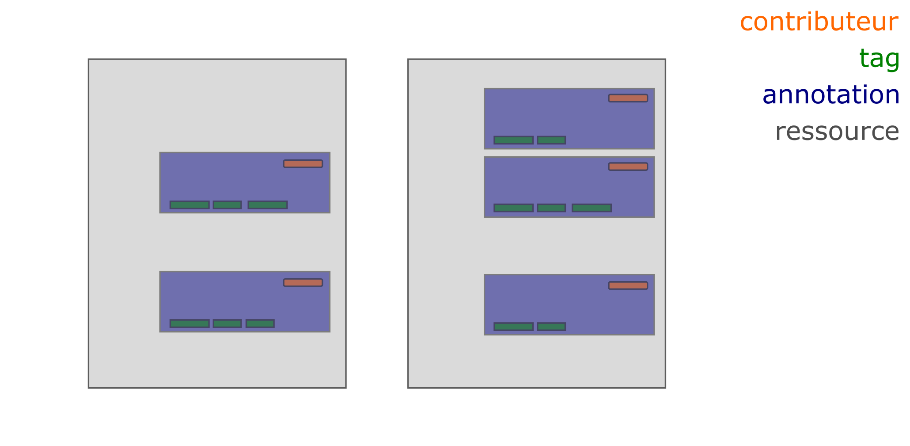
 

<small>Modèle de données en boite - à plat</small>

///

&nbsp;

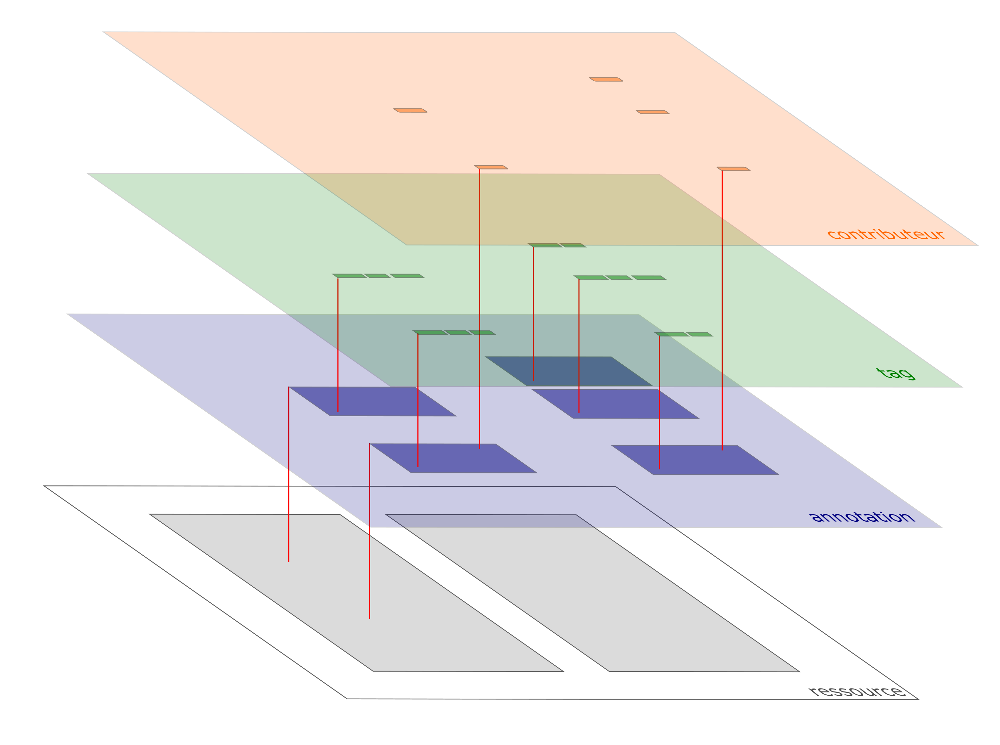

<small>Modèle de données en boite - projection</small>
 

!!

###Réseaux de pairs 
&nbsp;

<ul>
<li><i class="fa fa-user fa-lg"></i> <i class="fa fa-long-arrow-right fa-lg"></i> <i class="fa fa-file-o fa-lg"></i> <i class="fa fa-long-arrow-left fa-lg"></i> <i class="fa fa-user fa-lg"></i> &nbsp;</li>
<li><i class="fa fa-file-o fa-lg"></i> <i class="fa fa-long-arrow-left fa-lg"></i> <i class="fa fa-user fa-lg"></i><i class="fa fa-reply fa-lg"></i> <i class="fa fa-user fa-lg"></i> &nbsp;</li><!-- .element: class="fragment fade-in" -->
	<ul><li><i class="fa fa-file-o fa-lg"></i>.<i class="fa fa-user fa-lg"></i> <i class="fa fa-long-arrow-left fa-lg"></i> <i class="fa fa-user fa-lg"></i> &nbsp;</li></ul><!-- .element: class="fragment fade-in" -->
<li><i class="fa fa-user fa-lg"></i> <i class="fa fa-long-arrow-right fa-lg"></i> <i class="fa fa-tag fa-lg"></i> <i class="fa fa-long-arrow-left fa-lg"></i> <i class="fa fa-user fa-lg"></i> &nbsp;</li><!-- .element: class="fragment fade-in" -->
<li><i class="fa fa-files-o fa-lg"></i>.<i class="fa fa-users fa-lg"></i> &nbsp;</li><!-- .element: class="fragment fade-in" -->
</ul>

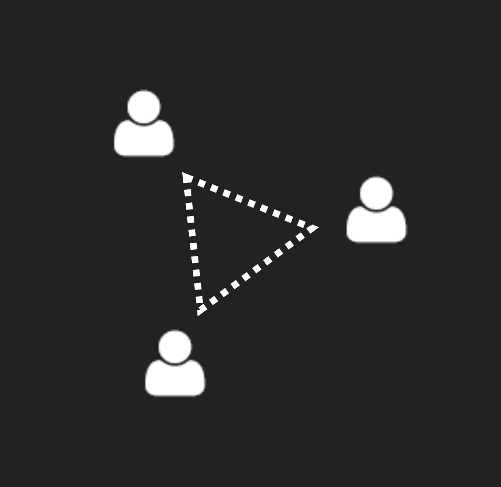

Note::
Ces modèles nous aident à identifier différents types de relations entre pairs, constitutive d'un réseau de pairs :

* **une relation forte entre des contributeurs** ayant annoté le même document. Il s'agit d'une relation spatiale, presque physique, où le document fait lieu, un lieu de rencontre, et de collaboration. Ces deux contributeurs ont en quelque sorte occupé temporairement le même espace, de manière synchrone ou asynchrone. Sans parler encore de communauté sur un même document, on peut identifier un groupe doué d'une motiviation commune, celle de faire la lecture de ce document, dont les intentions sont diverses et peuvent potentiellement se croiser.
On retrouve l'intimité instrumentale du modèle de blackboard ou tableau auquel Michel Gensollen rattache la contribution sur Amazon ou les communautés P2P ou de logiciel libre. Le principe est de laisser une trace visible et partagée aux futurs lecteurs.

* **une relation directe entre des contributeurs** se répondant les uns les autres, dont un sous-type serait **le lien entre le contributeur et l'auteur** du document initial. Je n'ai pas représenté l'auteur du document sur la modélisation précédente, mais il est évidemment essentiel pour le sujet qui nous intéresse aujourd'hui. 
* une relation plus faible mais puissante, inférée à partir **d'un même tag employé** par plusieurs contributeurs. Le lien est alors sémantique, le document s'efface au profit de la thématique, la rencontre est plus aléatoire, le lien est transversal, comme les chemins de navigation qu'il peut générer. il peut créer des accidents, des non-sens ou des associations heureuses. 
* d'autres relations peuvent encore exister, sur la base **de collections d'annotations par exemple constituées éditorialement**.

!!

###Réseaux de ressources
&nbsp;

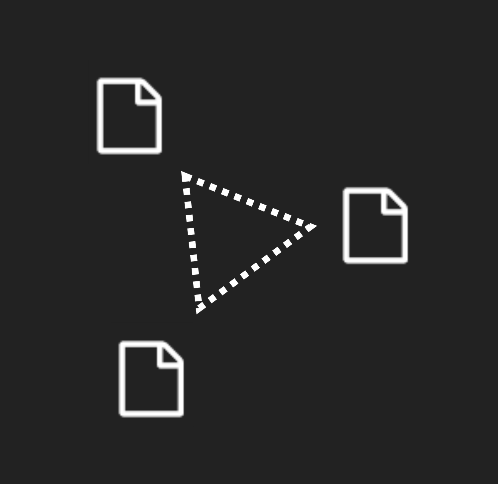

<ul><li><i class="fa fa-file-o"></i> <i class="fa fa-long-arrow-left"></i> <i class="fa fa-comment-o"></i> <i class="fa fa-long-arrow-right"></i> <i class="fa fa-tag"></i> <i class="fa fa-long-arrow-left"></i> <i class="fa fa-comment-o"></i> <i class="fa fa-long-arrow-right"></i> <i class="fa fa-file-o"></i> &nbsp;</li><!-- .element: class="fragment fade-in" -->
<li><i class="fa fa-file-o fa-lg"></i> <i class="fa fa-long-arrow-left fa-lg"></i> <i class="fa fa-comment-o fa-lg"></i>. (<i class="fa fa-file-o fa-lg"></i> ) &nbsp;</li><!-- .element: class="fragment fade-in" -->
<li><i class="fa fa-file-o fa-lg"></i> <i class="fa fa-long-arrow-left fa-lg"></i> <i class="fa fa-comment-o fa-lg"></i>. (<i class="fa fa-comment-o fa-lg"></i> ) &nbsp;</li><!-- .element: class="fragment fade-in" -->
</ul>

Note::- Sur ce service naissant qu'est hypothesis, le réseau le plus immédiat est celui des ressources **(documents / annotations)**, inférés par les tags
- et inférés par les annotations elles-mêmes, les annotations d'un document pouvant **référencer un autre document** ou encore **une annotation elle-même**.
- Ces réseaux de ressources procèdent à une légitimation dynamique des contenus tout aussi importante que celle qui procède du réseau d'individus et de leur statut d'autorité respectif.
- Cela est rendu possible car les annotations sous Hypothes.is contiennent avant tout des catégories descriptives et interprétatives des contenus annotés, et des non des catégories descriptives des identités.

!!

##Conclusion

Statut 
Code 
Licence 
Terms of service 
- 
Fonctionnalités 

 <!-- .element: class="fragment fade-in" -->

Échange 
Controverse 
Annotation 
Partage 
Temporalité 
Communautés 

 <!-- .element: class="fragment fade-in" -->

Storied collections 
The social lives of things 
New learning containers 
Ubiquitous curation 

<small><em>Knowledge Design</em>, Jeffrey Schnapp</small>

 <!-- .element: class="fragment fade-in" -->

<!--
<ul>
  <li>storied collections</li>
  <li>the social lives of things</li>
  <li>new learning containers</li>
  <li>ubiquitous curation</li>
</ul>

Hypothes.is
Academia.eu
ResearchGate
MyScience Work
Scalar
INKE
OpenEdition.org
 -->

Note:: Il faut conclure.
L'analyse de Hypothes.is est en cours, il conviendrait de faire son étude comparative avec d'autres services similaire, comparer son ADN, statut, code, licence, terms of service, et de ses fonctionnalités.
Cette étude permettrait de confirmer **quelques primitives** évoquées ici, ou **évoquées ailleurs** par Jeffrey Schnapp.

Je me suis intéressé davantage aux processus de circulation que de certification. Pourtant en fluidifiant la circulation des connaissances, on sent bien que les dispositifs d'éditorialisation diffuse le processus de certification sur des communautés hybrides et des temporalités plus longues, comme le fait justement Hypothes.is, et dont pourraient s'inspirer les lieux de savoirs.
Je vous remercie.

!!

###Merci
&nbsp; 
<small>nicolas.sauret@iri.centrepompidou.fr / [@nicolasauret](http://twitter.com/nicolasauret)</small> 

Note::
* autorité
* Littéracie

!!
<!--
##TODO

* modéliser les différentes couches de réseaux que constitue des dispositifs tels que Hypothes.is
* comparer les modélisations pour établir une typologie
* identifier les primitives pour un nouveau design de la connaissance (Jeffrey Schnapp)
* 

###Question à se poser : 

* quel degré de connectivité voulons nous ? > Schnapp : Cold spot to Hot spot

 ##14. Les primitives

* storied collections
* the social lives of things
* new learning containers
* ubiquitous curation

Note::En considérant ces deux enjeux, Jeffrey Schnapp a tenté de poser quelques primitives ou principes dans ce qu'il a appelé le Knowledge Design, ou le design de la connaissances. C'est une référence qui m'a été soufflé par Milad Douhei et qui m'a effectivement été particulièrement inspirante, car Schnapp adopte une démarche similaire à la mienne qui est d'articuler une réflexion SHS avec la conception et l'implémentation de nouveaux dispositifs de circulation et d'appropriation. 
Il pose ces 4 noeuds essentiels selon lui aux humanités numériques :

#15. Sans détailler une à une ces primitives, j'ai voulu identifier ce qui me paraissait également essentiel :

* visualiser, zoomer/dezoomer
* naviguer, analyser, interprêter.
* indexer, éditorialiser : traitement informatique
* annotater, partager, éditorialiser : traitement éditorial
* collecter et produire de nouveaux objets culturels (cad, ressources appropriées)
* échange, controverse, catégories : constituer des communautés de savoir
* question de la temporalité (L Merzeau) à l'oeuvre dans les processus de circulation des connaissances.
* une indexation permettant des traitements informatiques > web sémantique, qui parle aux humains et aux machines.
* adresser plusieurs communautés et générer des points de contact : cercles concentriques d'engagement, faire tomber les barrières d'expertise.

!! -->
